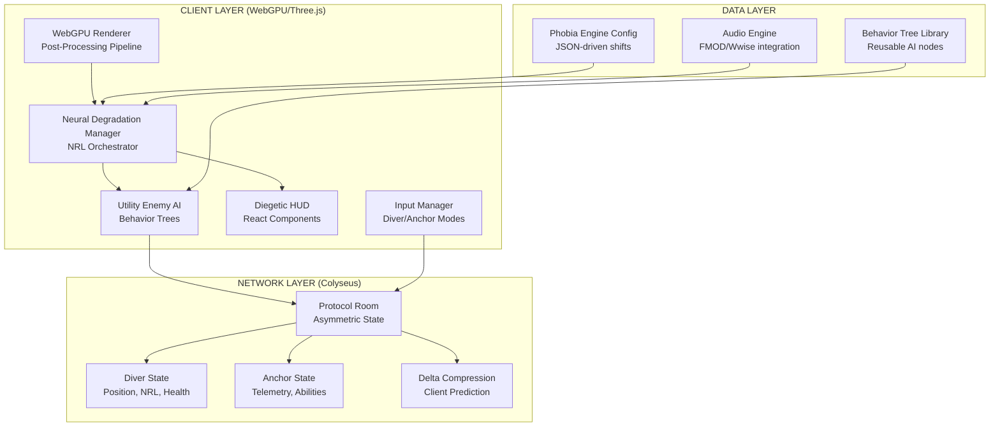

# THE LUCID PROTOCOL - AAA Architecture

## Systemic Horror Engine Architecture



## Core Systems Breakdown

### 1. Neural Degradation Manager (NDM)
**Responsibility:** Central orchestrator that monitors NRL and triggers systemic responses

**Data Flow:**
```
Player Input → NRL Calculation → NDM → [Environment Shifts, UI Gaslighting, Audio Distortion, AI Behavior Modulation]
```

**Key Features:**
- Data-driven phobia engine (JSON config)
- Threshold-based environment mutations
- Real-time UI deception system
- Audio parameter modulation
- AI behavior influence

### 2. Utility Enemy AI
**Responsibility:** Advanced adversary behavior with perception, investigation, and tactical flanking

**Behavior Tree Structure:**
```
Root (Selector)
├── Sequence: Attack
│   ├── Condition: In Melee Range
│   └── Action: Attack
├── Sequence: Flank
│   ├── Condition: Ally Spotted Player
│   ├── Condition: Has Cover Node
│   └── Action: Move to Cover
├── Sequence: Investigate
│   ├── Condition: Heard Sound
│   └── Action: Move to Last Known Position
├── Sequence: Patrol
│   └── Action: Follow Patrol Path
└── Sequence: Search
    ├── Condition: Lost Player
    └── Action: Search Area
```

**Perception System:**
- Vision cone (angle + distance)
- Hearing radius (sound events)
- Memory of last known player position
- Communication with allies

### 3. Asymmetric Network (Diver/Anchor)
**Responsibility:** Two distinct client roles with different data and abilities

**Diver Client:**
- Receives: 3D environment, physics, local hallucinations
- Sends: Position, rotation, actions
- Predicts: Movement (client-side)

**Anchor Client:**
- Receives: 2D schematic, Diver telemetry, enemy pings
- Sends: Abilities (unlock_door, suppress_NRL, ping_enemy)
- No direct control over Diver

**Network Optimization:**
- Delta compression for state changes
- Client-side prediction with server reconciliation
- Interest management (only send relevant data)

## Performance Targets

| Metric | Target | Strategy |
|--------|--------|----------|
| FPS | 60 | Object pooling, frustum culling, LOD |
| Memory | <512MB | Asset streaming, texture atlasing |
| Network | <100ms | Delta compression, prediction |
| Load Time | <5s | Code splitting, lazy loading |

## Data-Driven Design

All environment shifts, AI behaviors, and phobia responses are configured via JSON:

```json
{
  "nrlThresholds": {
    "corridorElongation": 40,
    "wallTextureSwap": 60,
    "lightingShift": 75
  },
  "environmentMutations": [
    {
      "trigger": "nrl > 40",
      "action": "elongateCorridor",
      "parameters": { "factor": 1.5, "duration": 5000 }
    }
  ]
}
```

## Integration Points

### Blender Asset Pipeline
- Export glTF with custom properties for NRL triggers
- Bake lighting for performance
- LOD generation automated via script

### FMOD/Wwise Audio
- RTPC (Real-Time Parameter Control) tied to NRL
- Spatial audio for enemy perception
- Dynamic music layers based on tension

### Analytics & Balancing
- Track NRL progression curves
- Monitor enemy detection rates
- A/B test phobia responses
